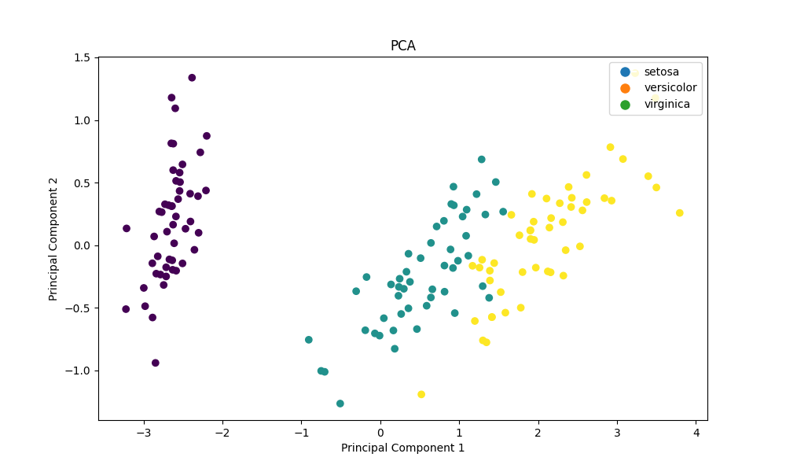
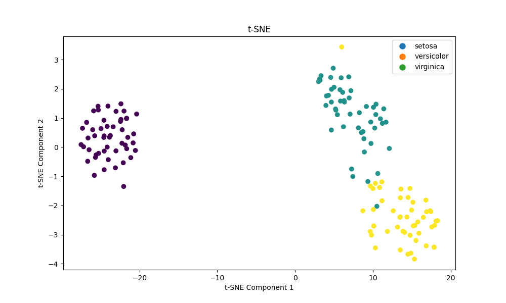

# Autonomous Multi‑Agent AI System for Data Science Workflows

An AI‑driven multi‑agent system built with **Python** and **LangGraph** that autonomously performs end‑to‑end data‑science workflows. The system uses coordinated LLM agents to interpret user queries, plan workflows, generate Python code, execute it in a sandbox, debug errors, evaluate results, and iteratively refine the analysis.

This project demonstrates how large language models collaborate through structured agent roles, shared memory, and iterative reasoning loops to produce reliable, self‑correcting data‑science pipelines.

---

## ✨ Key Features

- Autonomous multi‑agent workflow for data‑science tasks  
- Agents for query interpretation, planning, code generation, execution, debugging, and result evaluation  
- Sandboxed Python execution with automatic error detection and correction  
- Iterative reasoning loops that refine analysis based on observed outputs  
- Dynamic matplotlib visualizations generated directly by LLM agents  
- Shared agent memory using chat‑history to synchronize reasoning  
- Agents generate Python code using **pandas**, **numpy**, **matplotlib**, **scikit‑learn**, and **seaborn**

---

## 🧠 Agent Roles

### **planner**
Creates the high‑level workflow plan for the entire project.

### **reviewer**
Evaluates results, checks correctness, and suggests next research steps.

### **scientist**
Converts planner steps into structured requests for the Python developer.

### **developer**
Generates Python code for data‑science analysis based on the scientist’s instructions.

### **tester**
Runs the generated Python code in a sandbox, checks outputs, detects errors, and reports issues.

### **finalizer**
Optimizes the full codebase, removes redundancy, and rewrites code into a clean, professional form.

## 🚀 Quick Start

To run this project, you must create **two virtual environments**:  
one for the multi‑agent system and one for executing agent‑generated Python code.  
You must also configure your TogetherAI API key.

### Run everything in order as shown below:

### MacOS
```bash
# Create virtual environment for multi-agent system
python -m venv <multi-agent-env>
source <multi-agent-env>/bin/activate
pip install -r requirements.txt

# Create virtual environment for executing agent-generated Python code
python -m venv <sandbox-env>
source <sandbox-env>/bin/activate
pip install -r sandbox_requirements.txt

# IMPORTANT:
# The <sandbox-env> name must match the "runtime" value in your configuration file (e.g., pyproject.toml)

# Add TogetherAI API key
vi ~/.profile   # add: export TOGETHER_API_KEY=<your_key>
. ~/.profile

# Run the multi-agent system
python main.py [-h] -q QUERY [-d DATA] [-c CONFIG]

# Example:
python main.py -q "Load the iris dataset and create a scatter plot of sepal length vs sepal width, colored by species"
```


### (Optional) Run agent-generated code directly
```bash
python -m venv <sandbox-env>
source <sandbox-env>/bin/activate
pip install -r sandbox_requirements.txt
python <path to python script>
```

### Windows
```bash
# Allows PowerShell to run local scripts while still blocking unsigned scripts downloaded from the internet.
Set-ExecutionPolicy RemoteSigned -Scope CurrentUser
# Create virtual environment for multi-agent system
python -m venv <multi-agent-env>
.\<multi-agent-env>\Scripts\Activate.ps1
pip install -r requirements.txt

# Create virtual environment for executing agent-generated Python code
python -m venv <sandbox-env>
.\<sandbox-env>\Scripts\Activate.ps1
pip install -r sandbox_requirements.txt

# IMPORTANT:
# The <sandbox-env> name must match the "runtime" value in your configuration file (e.g., pyproject.toml)

# Add TogetherAI API key
$env:TOGETHER_API_KEY="<your_key>"
or
setx TOGETHER_API_KEY "<your_key>"
After using setx, close and reopen PowerShell so the variable loads.

# Run the multi-agent system
python main.py -q "your query here" -d <DATA> -c <CONFIG>

# Example:
python main.py -q "Load the iris dataset and create a scatter plot of sepal length vs sepal width, colored by species"
```

### (Optional) Run agent-generated code directly
```bash
# Allows PowerShell to run local scripts while still blocking unsigned scripts downloaded from the internet.
Set-ExecutionPolicy RemoteSigned -Scope CurrentUser
python -m venv <sandbox-env>
.\<sandbox-env>\Scripts\Activate.ps1
pip install -r sandbox_requirements.txt
python <path to python script>
```

## 📁 Examples

Instead of passing a query via the command line, you can execute predefined data science workflows using configuration files.
All the lltm generated contents are saved in output directory, for instance, Python source code, log file, image files.

### Iris Dataset Example (`./examples/iris/config.toml`)
This configuration automates an exploratory analysis and advanced dimensionality reduction pipeline on the public Iris dataset:
* **Data Preparation**: Dynamically builds a Pandas DataFrame from the raw `iris.data` and features.
* **Exploratory Analysis**: Automatically writes and runs visualization code targeting Sepal dimensions.
* **Advanced Research**: Iteratively branches out to perform **PCA** (Principal Component Analysis) and **t-SNE** algorithms to evaluate and compare clusters in lower-dimensional space.
```bash
python main.py -c ./examples/iris/config.toml
```
_vs_sepal_width_(cm).png)



### USDA Zinc Analysis (`./examples/zinc/config.toml`)
This example demonstrates how the multi‑agent system can autonomously reproduce and extend a real data‑analysis task from Chapter 13.4 of [Python for Data Analysis (3rd Edition)](https://www.amazon.com/dp/109810403X).
The original exercise computes the median zinc value for each USDA food group using the public dataset:
Dataset:  
https://github.com/wesm/pydata-book/blob/3rd-edition/datasets/usda_food/database.json  
(USDA SR Legacy Food Composition Database, publicly available in the book’s GitHub repository)

* **Autonomous Analysis**: LLM agents can autonomously perform real data‑science tasks.
* **Result Reproduction**: workflow matches published textbook results, proving correctness.
* **Extended Insights**: system goes beyond the textbook, producing deeper statistical insights.
* **Fully Automated Workflow**: All code is generated, executed, and validated automatically.

```bash
python main.py -c ./examples/zinc/config.toml
```
.png)
